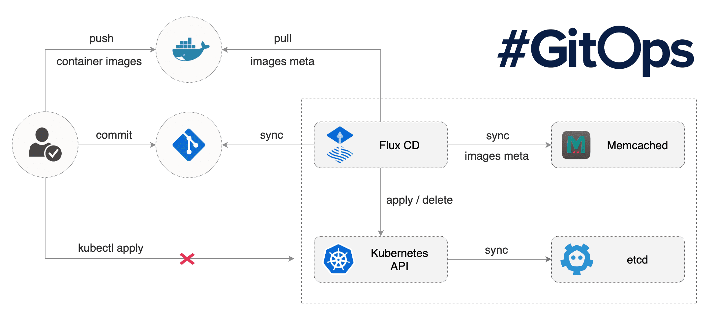

# Flux

> **Announcement** [Flux has joined CNCF as a sandbox project](https://www.weave.works/blog/flux-joins-the-cncf-sandbox)

We believe in GitOps:

- **You declaratively describe the entire desired state of your
  system in git.** This includes the apps, config, dashboards,
  monitoring and everything else.
- **What can be described can be automated.** Use YAMLs to enforce
  conformance of the system. You don't need to run `kubectl`, all changes go
  through git. Use diff tools to detect divergence between observed and
  desired state and get notifications.
- **You push code not containers.** Everything is controlled through
  pull requests. There is no learning curve for new devs, they just use
  your standard git PR process. The history in git allows you to recover
  from any snapshot as you have a sequence of transactions. It is much
  more transparent to make operational changes by pull request, e.g.
  fix a production issue via a pull request instead of making changes to
  the running system.

Flux is a tool that automatically ensures that the state of a cluster
matches the config in git. It uses an operator in the cluster to trigger
deployments inside Kubernetes, which means you don't need a separate CD tool.
It monitors all relevant image repositories, detects new images, triggers
deployments and updates the desired running configuration based on that
(and a configurable policy).

The benefits are: you don't need to grant your CI access to the cluster, every
change is atomic and transactional, git has your audit log. Each transaction
either fails or succeeds cleanly. You're entirely code centric and don't need
new infrastructure.

## What Flux does

Flux is most useful when used as a deployment tool at the end of a
Continuous Delivery pipeline. Flux will make sure that your new
container images and config changes are propagated to the cluster.

### Who is using Flux in production

|    |     |     |
| -- | --- | --- |
|[ABA English](https://www.abaenglish.com)|[APPUiO](https://appuio.ch)|[Apester](https://apester.com)
|[ArangoDB Oasis](https://arangodb.com/managed-service)|[Avisi](https://avisi.nl)|[B3i](https://b3i.tech/)
|[Babylon Health](https://www.babylonhealth.com/)|[bimspot](https://bimspot.io)|[BlaBlaCar](https://www.blablacar.com/)
|[Canva](https://www.canva.com/)|[Cloudlets](https://cloudlets.io)|[CLVR Cloud Ltd](https://clvr.cloud)
|[College of William & Mary](https://www.wm.edu)|[Control Plane](https://control-plane.io)|[Consorcio Chile](https://www.consorcio.cl)
|[CrowdRiff](https://crowdriff.com)|[Cybrary](https://cybrary.it)|[FireHydrant](https://firehydrant.io)
|[Gini](https://gini.net)|[HMCTS](https://www.gov.uk/government/organisations/hm-courts-and-tribunals-service)|[IBM Cloudant](https://www.ibm.com/cloud/cloudant)
|[Improwised Technologies](https://www.improwised.com/)|[Infabode](https://infabode.com)|[iQmetrix](https://www.iqmetrix.com)
|[karriere tutor GmbH](https://www.karrieretutor.de)|[Limejump](https://limejump.com)|[loveholidays](https://www.loveholidays.com/)
|[LUNAR](https://www.lunarway.com/)|[Mettle](https://mettle.co.uk)|[Mintel](https://www.mintel.com)
|[Multicaja S.A](https://www.multicaja.cl)|[Omise](https://www.omise.co)|[Payout](https://payout.one)
|[Qordoba](https://qordoba.com)|[Rakuten](https://rakuten.com)|[Replicated](https://replicated.com)
|[Rungway](https://rungway.com)|[Sage AI Labs](https://www.sage.com)|[Starbucks](https://www.starbucks.com/)
|[Troii](https://troii.com/)|[UK Hydrographic Office](https://www.gov.uk/government/organisations/uk-hydrographic-office)|[Under Armour](https://www.underarmour.com)
|[VSHN](https://vshn.ch)|[Walmart Chile](https://www.walmartchile.cl)|[Weave Cloud](https://cloud.weave.works)
|[Workable](https://www.workable.com)|[Workarea](https://www.workarea.com)|[Working Group Two](https://wgtwo.com)
|[Yusofleet](https://yusofleet.com)|[Yad2](https://yad2.co.il)|[Zaaksysteem](https://zaaksysteem.nl)|

If you too are using Flux in production; please submit a PR to add your organization to the list!

### History

In the first years of its existence, the development of Flux was very
closely coupled to that of [Weave
Cloud](https://www.weave.works/product/cloud/). Over the years the community
around Flux grew, the numbers of [integrations](#integrations) grew and
the team started the process of generalising the code, so that more projects
could easily integrate.

## Get started with Flux

With the following tutorials:

- [Get started with Flux](https://docs.fluxcd.io/en/latest/tutorials/get-started.html)
- [Get started with Flux using Helm](https://docs.fluxcd.io/en/latest/tutorials/get-started-helm.html)

or just [browse through the documentation](https://docs.fluxcd.io).

Do you want to release your Helm charts in a declarative way?
Take a look at the [`fluxcd/helm-operator`](https://github.com/fluxcd/helm-operator).

### Integrations

As Flux is Open Source, integrations are very straight-forward. Here are
a few popular ones you might want to check out:

- [Manage a multi-tenant cluster with Flux and Kustomize](https://github.com/fluxcd/multi-tenancy)
- [Managing Helm releases the GitOps way](https://github.com/fluxcd/helm-operator-get-started)
- [OpenFaaS GitOps workflow with Flux](https://github.com/stefanprodan/openfaas-flux)
- [GitOps for Istio Canary deployments](https://github.com/stefanprodan/gitops-istio)
- [Fluxcloud to receive events from Flux](https://github.com/justinbarrick/fluxcloud)

## Community & Developer information

We welcome all kinds of contributions to Flux, be it code, issues you found,
documentation, external tools, help and support or anything else really.

The Flux project adheres to the [CNCF Code of
Conduct](https://github.com/cncf/foundation/blob/master/code-of-conduct.md).

Instances of abusive, harassing, or otherwise unacceptable behavior
may be reported by contacting a _Flux_ project maintainer, or the CNCF
mediator, Mishi Choudhary <mishi@linux.com>.

To familiarise yourself with the project and how things work, you might
be interested in the following:

- [Our contributions guidelines](CONTRIBUTING.md)
- [Build documentation](https://docs.fluxcd.io/en/latest/contributing/building.html)
- [Release documentation](/internal_docs/releasing.md)

## Getting Help

If you have any questions about Flux and continuous delivery:

- Read [the Flux docs](https://docs.fluxcd.io).
- Invite yourself to the <a href="https://slack.cncf.io" target="_blank">CNCF community</a>
  slack and ask a question on the [#flux](https://cloud-native.slack.com/messages/flux/)
  channel.
- To be part of the conversation about Flux's development, join the
  [flux-dev mailing list](https://lists.cncf.io/g/cncf-flux-dev).
- [File an issue.](https://github.com/fluxcd/flux/issues/new/choose)

Your feedback is always welcome!

