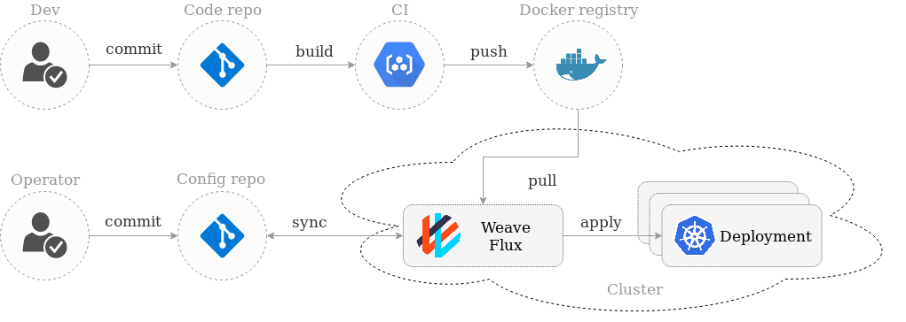

# Flux

We believe in GitOps:

- **You declaratively describe the entire desired state of your
  system in git.** This includes the apps, config, dashboards,
  monitoring and everything else.
- **What can be described can be automated.** Use YAMLs to enforce
  conformance of the system. You don't need to run `kubectl`, all changes go
  through git. Use diff tools to detect divergence between observed and
  desired state and get notifications.
- **You push code not containers.** Everything is controlled through
  pull requests. There is no learning curve for new devs, they just use
  your standard git PR process. The history in git allows you to recover
  from any snapshot as you have an sequence of transactions. It is much
  more transparent to make operational changes by pull request, e.g.
  fix a production issue via a pull request instead of making changes to
  the running system.

Flux is a tool that automatically ensures that the state of a cluster
matches the config in git. It uses an operator in the cluster to trigger
deployments inside Kubernetes, which means you don't need a separate CD tool.
It monitors all relevant image repositories, detects new images, triggers
deployments and updates the desired running configuration based on that
(and a configurable policy).

The benefits are: you don't need to grant your CI access to the cluster, every
change is atomic and transactional, git has your audit log. Each transaction
either fails or succeeds cleanly. You're entirely code centric and don't need
new infrastructure.

## What Flux does

Flux is most useful when used as a deployment tool at the end of a
Continuous Delivery pipeline. Flux will make sure that your new
container images and config changes are propagated to the cluster.

### Features

Its major features are:

- [Automated git → cluster synchronisation](/site/introduction.md#automated-git-cluster-synchronisation)
- [Automated deployment of new container images](/site/introduction.md#automated-deployment-of-new-container-images)
- [Integrations with other devops tools](/site/introduction.md#integrations-with-other-devops-tools) ([Helm](/site/helm/helm-integration.md) and more)
- No additional service or infrastructure needed - Flux lives inside your
  cluster
- Straight-forward control over the state of deployments in the
  cluster (rollbacks, lock a specific version of a workload, manual
  deployments)
- Observability: git commits are an audit trail, and you can record
  e.g., why a given deployment was locked.

### Relation to Weave Cloud

Weave Cloud builds on top of the great work in Flux and is a SaaS product
by Weaveworks that along with a UI and alerts for deployments, gives you
full observability and insights into your cluster as well. It simplifies
deployment, monitoring and management for containers and microservices.
Here is an overview of their feature sets:

|                                                                                                  | OSS Flux | Weave Cloud |
| ------------------------------------------------------------------------------------------------ |:--------:|:-----------:|
| &#x026AB; Continuously deploy any workload into Kubernetes                                       | x        | x           |
| &#x026AB; Automated (or one-click manual) deployments and rollbacks                              | x        | x           |
| &#x026AB; Audit trail (who did what when) of deployments/commits/alerts/notifications            | x        | x           |
| &#x026AB; Batch operations (control workloads and their deployment strategies easily)            | x        | x           |
| &#x026AB; Ensures that the cluster state matches the config in git                               | x        | x           |
| &#x026AB; Interrupt automatic deployments and document why                                       | x        | x           |
| &#x026AB; Helm support for deployments (alpha)                                                   | x        | x           |
| &#x026AB; Dashboard + Overview of the deployment state (version, automation status, locks, etc). |          | x           |
| &#x026AB; Web UI with one-click ops, set up deployment config easily                             |          | x           |
| &#x026AB; Custom alerts (Route deployment notifications to slack, email, browser)                |          | x           |
| &#x026AA; Automated monitoring and dashboards for workloads and nodes right after install        |          | x           |
| &#x026AA; Many built-in metrics*, including [RED metrics] (error rate/latency of requests)       |          | x           |
| &#x026AA; Jupyter-style notebooks + dashboards                                                   |          | x           |
| &#x026AA; Learn from 13 months of hosted Prometheus-based metrics and cluster state              |          | x           |
| &#x026AA; Use GCP Stackdriver and get logs and events aggregated                                 |          | x           |
| &#x026AA; Debug and explore the state of your cluster in real-time                               |          | x           |
| &#x026AA; Many more [observability features in Weave Cloud]                                      |          | x           |
| &#x026AA; Many more [monitoring features in Weave Cloud]                                         |          | x           |

| Legend                                                                                             |
| -------------------------------------------------------------------------------------------------- |
| &#x026AB; GitOps feature                                                                           |
| &#x026AA; Observability feature                                                                    |
| * this includes many language- and framework-specific metrics, e.g. go, jvm, http, etc. |

If you want to learn more about Weave Cloud, you can see it in action on
[its homepage](https://www.weave.works/product/cloud/).

[RED metrics]: https://www.weave.works/blog/the-red-method-key-metrics-for-microservices-architecture/
[observability features in Weave Cloud]: https://bit.ly/2MvFOmi
[monitoring features in Weave Cloud]: https://bit.ly/2MxQCAv

## Get started with Flux

Get started by browsing through the documentation below:

- Background about Flux
  - [Introduction to Flux](/site/introduction.md)
  - [FAQ](/site/faq.md)
  - [How it works](/site/how-it-works.md)
  - [Considerations regarding installing Flux](/site/installing.md)
- Get Started with Flux
  - [Standalone Flux](/site/standalone/installing.md)
  - [Flux using Helm](/site/helm/installing.md)
- Operating Flux
  - [Using Flux](/site/using.md)
  - [Troubleshooting](/site/troubleshooting.md)
  - [Upgrading to Flux v1](/site/upgrading-to-1.0.md)

## Developer information

[Build documentation](/site/building.md)

[Release documentation](/internal_docs/releasing.md)

### Contribution

Flux follows a typical PR workflow.
All contributions should be made as PRs that satisfy the guidelines below.

### Guidelines

- All code must abide [Go Code Review Comments](https://github.com/golang/go/wiki/CodeReviewComments)
- Names should abide [What's in a name](https://talks.golang.org/2014/names.slide#1)
- Code must build on both Linux and Darwin, via plain `go build`
- Code should have appropriate test coverage, invoked via plain `go test`

In addition, several mechanical checks are enforced.
See [the lint script](/lint) for details.

## Getting Help

If you have any questions about Flux and continuous delivery:

- Read [the Weave Flux docs](https://github.com/weaveworks/flux/tree/master/site).
- Invite yourself to the <a href="https://weaveworks.github.io/community-slack/" target="_blank">Weave community</a> slack.
- Ask a question on the [#flux](https://weave-community.slack.com/messages/flux/) slack channel.
- Join the <a href="https://www.meetup.com/pro/Weave/"> Weave User Group </a> and get invited to online talks, hands-on training and meetups in your area.
- Send an email to <a href="mailto:weave-users@weave.works">weave-users@weave.works</a>
- <a href="https://github.com/weaveworks/flux/issues/new">File an issue.</a>

Your feedback is always welcome!
