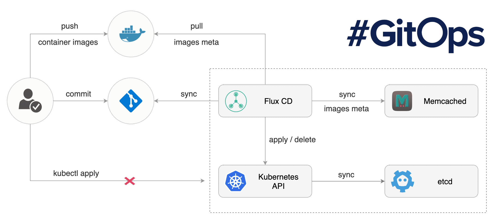

# Flux

> **Notice** Flux is moving house! Please see https://github.com/weaveworks/flux/wiki/MoveToFluxCD

We believe in GitOps:

- **You declaratively describe the entire desired state of your
  system in git.** This includes the apps, config, dashboards,
  monitoring and everything else.
- **What can be described can be automated.** Use YAMLs to enforce
  conformance of the system. You don't need to run `kubectl`, all changes go
  through git. Use diff tools to detect divergence between observed and
  desired state and get notifications.
- **You push code not containers.** Everything is controlled through
  pull requests. There is no learning curve for new devs, they just use
  your standard git PR process. The history in git allows you to recover
  from any snapshot as you have a sequence of transactions. It is much
  more transparent to make operational changes by pull request, e.g.
  fix a production issue via a pull request instead of making changes to
  the running system.

Flux is a tool that automatically ensures that the state of a cluster
matches the config in git. It uses an operator in the cluster to trigger
deployments inside Kubernetes, which means you don't need a separate CD tool.
It monitors all relevant image repositories, detects new images, triggers
deployments and updates the desired running configuration based on that
(and a configurable policy).

The benefits are: you don't need to grant your CI access to the cluster, every
change is atomic and transactional, git has your audit log. Each transaction
either fails or succeeds cleanly. You're entirely code centric and don't need
new infrastructure.

## What Flux does

Flux is most useful when used as a deployment tool at the end of a
Continuous Delivery pipeline. Flux will make sure that your new
container images and config changes are propagated to the cluster.

### Features

Its major features are:

- [Automated git → cluster synchronisation](/site/introduction.md#automated-git-cluster-synchronisation)
- [Automated deployment of new container images](/site/introduction.md#automated-deployment-of-new-container-images)
- [Integrations with other devops tools](/site/introduction.md#integrations-with-other-devops-tools) ([Helm](/site/helm-integration.md) and more)
- No additional service or infrastructure needed - Flux lives inside your
  cluster
- Straight-forward control over the state of deployments in the
  cluster (rollbacks, lock a specific version of a workload, manual
  deployments)
- Observability: git commits are an audit trail, and you can record events that
  occured, for example: why a given deployment was locked.

### Who is using Flux in production

- [ABA English](https://www.abaenglish.com)
- [APPUiO](https://appuio.ch)
- [ArangoDB Oasis](https://arangodb.com/managed-service)
- [Avisi](https://avisi.nl)
- [Babylon Health](https://www.babylonhealth.com/)
- [College of William & Mary](https://www.wm.edu)
- [Control Plane](https://control-plane.io)
- [Crowd Riff](https://crowdriff.com)
- [FireHydrant](https://firehydrant.io)
- [Gini](https://gini.net)
- [Improwised Technologies](https://www.improwised.com/)
- [iQmetrix](https://www.iqmetrix.com)
- [karriere tutor GmbH](https://www.karrieretutor.de)
- [loveholidays](https://www.loveholidays.com/)
- [Mettle](https://mettle.co.uk)
- [Payout](https://payout.one)
- [Qordoba](https://qordoba.com)
- [Rungway](https://rungway.com)
- [Troii](https://troii.com/)
- [Under Armour](https://www.underarmour.com)
- [VSHN](https://vshn.ch)
- [Weave Cloud](https://cloud.weave.works)

If you too are using Flux in production; please submit a PR to add your organization to the list!

### History

In the first years of its existence, the development of Flux was very
closely coupled to that of [Weave
Cloud](https://www.weave.works/product/cloud/). Over the years the community
around Flux grew, the numbers of [integrations](#integrations) grew and
the team started the process of generalising the code, so that more projects
could easily integrate.

## Get started with Flux

Get started by browsing through the documentation below:

- Background about Flux
  - [Introduction to Flux](/site/introduction.md)
  - [FAQ](/site/faq.md) and [frequently encountered issues](https://github.com/weaveworks/flux/labels/FAQ)
  - [How it works](/site/how-it-works.md)
  - [Considerations regarding installing Flux](/site/installing.md)
  - [Flux <-> Helm integration](/site/helm-integration.md)
- Get Started with Flux
  - [Standalone Flux](/site/get-started.md)
  - [Flux using Helm](/site/helm-get-started.md)
  - [Automation: annotations and locks](/site/annotations-tutorial.md)
- Operating Flux
  - [Using fluxctl to control Flux](/site/fluxctl.md)
  - [Helm Operator](/site/helm-operator.md)
  - [Troubleshooting](/site/troubleshooting.md)
  - [Frequently encountered issues](https://github.com/weaveworks/flux/labels/FAQ)
  - [Upgrading to Flux v1](/site/upgrading-to-1.0.md)

### Integrations

As Flux is Open Source, integrations are very straight-forward. Here are
a few popular ones you might want to check out:

- [Managing Helm releases the GitOps way](https://github.com/stefanprodan/gitops-helm)
- [OpenFaaS GitOps workflow with Flux](https://github.com/stefanprodan/openfaas-flux)
- [GitOps for Istio Canary deployments](https://github.com/stefanprodan/gitops-istio)
- [Fluxcloud to receive events from Flux](https://github.com/justinbarrick/fluxcloud)

## Community & Developer information

We welcome all kinds of contributions to Flux, be it code, issues you found,
documentation, external tools, help and support or anything else really.

Instances of abusive, harassing, or otherwise unacceptable behavior
may be reported by contacting a *Flux* project maintainer, or Alexis
Richardson `<alexis@weave.works>`. Please refer to our [code of
conduct](CODE_OF_CONDUCT.md) as well.

To familiarise yourself with the project and how things work, you might
be interested in the following:

- [Our contributions guidelines](CONTRIBUTING.md)
- [Build documentation](/site/building.md)
- [Release documentation](/internal_docs/releasing.md)

## Getting Help

If you have any questions about Flux and continuous delivery:

- Read [the Flux docs](https://github.com/weaveworks/flux/tree/master/site).
- Invite yourself to the <a href="https://slack.weave.works/" target="_blank">Weave community</a>
  slack and ask a question on the [#flux](https://weave-community.slack.com/messages/flux/)
  channel.
- To be part of the conversation about Flux's development, join the
  [flux-dev mailing list](https://groups.google.com/forum/#!forum/flux-dev).
- Join the [Weave User Group](https://www.meetup.com/pro/Weave/) and get
  invited to online talks, hands-on training and meetups in your area.
- [File an issue.](https://github.com/weaveworks/flux/issues/new)

Your feedback is always welcome!
